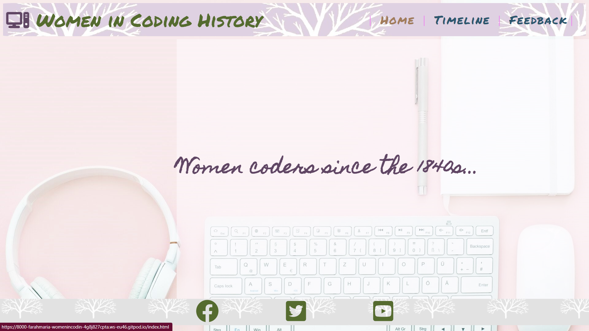
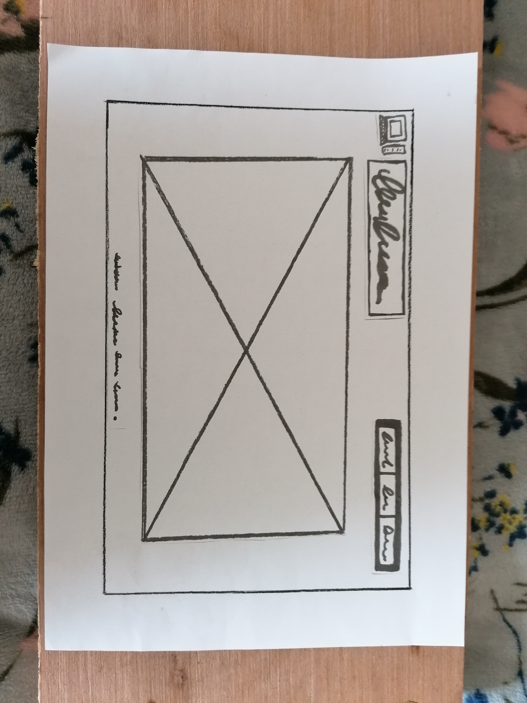
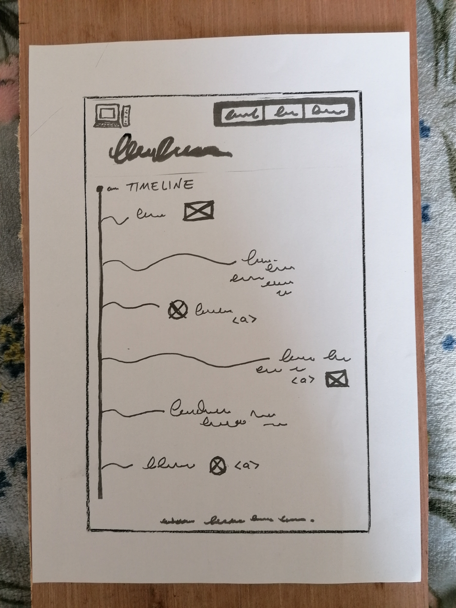
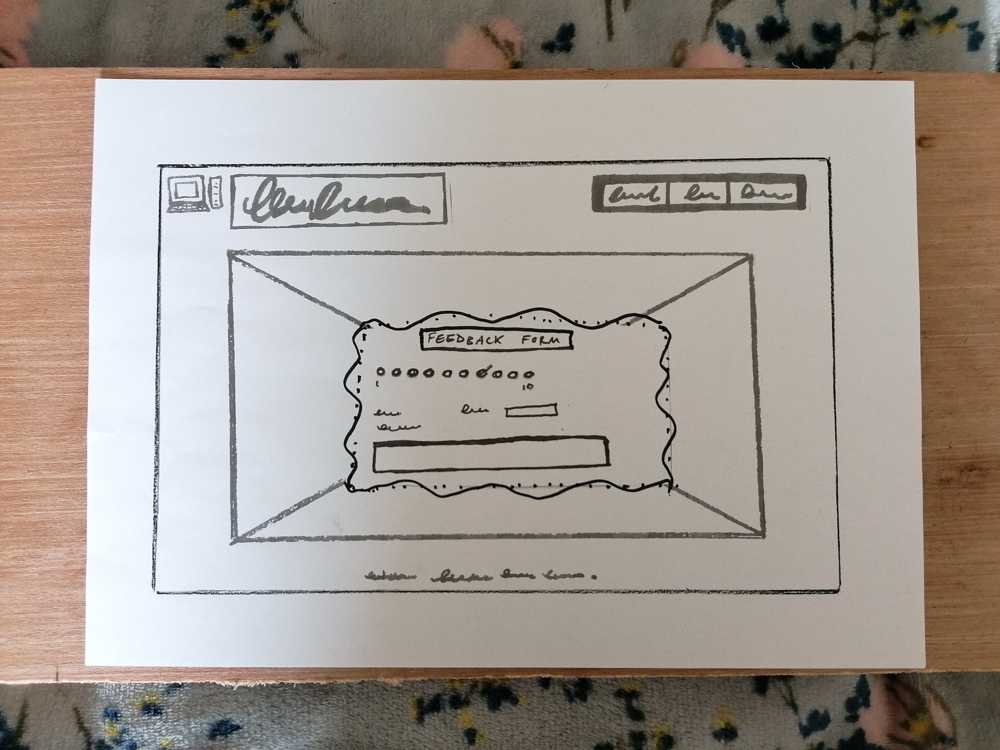
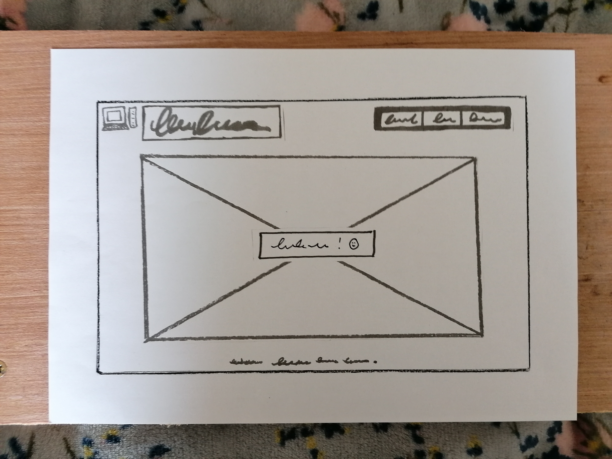
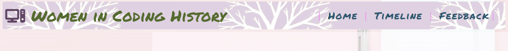
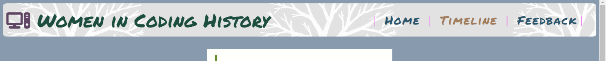
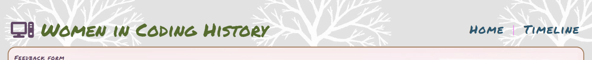
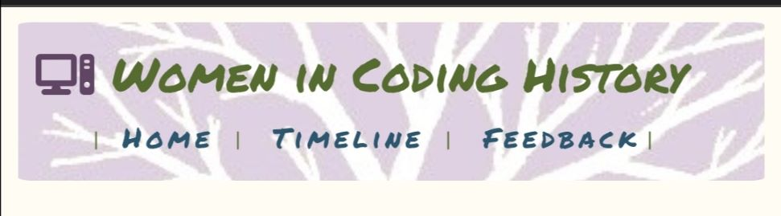
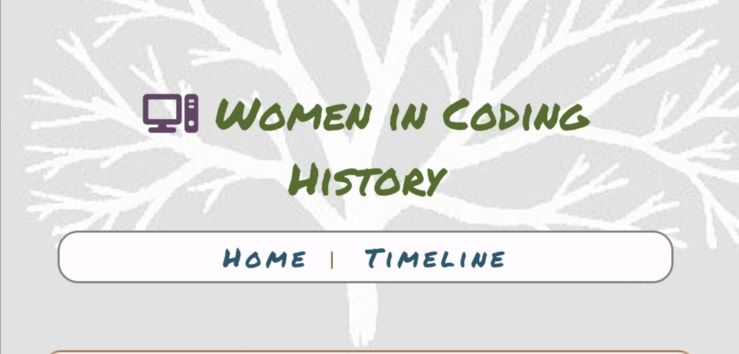

# **Women in Coding History (WICH)**

Did you know that women have been writing machine-readable code since the 1840s? And that coding used to be considered "women's work"? Yet according to a Statista poll taken in 2021, only 5% of software developers worldwide are female.

This site is both a general interest and educational resource that shows how women have in fact shaped the world of coding since its inception, from before the first computing device was even invented. The website includes an illustrated timeline. This will eventually include current and future projects being headed by female coders, not just historical figures. I also hope to add a page with links to resources for women and girls who want to learn more about coding and the tech industry. 

The project is a work in progress, with more figures who need including on the timeline. It is aimed at both school children and adults who do not necessarily know much about programming, tech, or the history behind its development. Any technical terms used are therefore explained in simple and accessible language. 

The objective is to educate and engage women and girls who would not "normally" be interested in this subject or who are new to it. The colour palette and imagery is therefore gentle, non-glaring, friendly, and "soft". The site is meant to be inviting to those who might otherwise feel intimidated by tech talk. 

The greater aim is to contribute towards gender equality in the field of software engineering and to raise awareness of the great accomplishments already been achieved by female coders. The knowledge of positive role models, past and present, will hopefully inspire women and girls to feel "I could do this, too!"

## **User Experience, Scope & Design**

Accessibility is an important part of this project, not only it is central to how this particular work is being assessed but because, as mentioned above, this is a site aimed at a non-specialist audience aged 13 years and up. Young readers need content that is easier to understand and navigate, as do those who may not describe themselves as “tech-savvy”.
Simple language is used throughout the site for this reason, and the inclusion of images and media links keeps the content varied, engaging and educational for those who want to explore more about the female coders introduced on the timeline.
A timeline format was used as this lay-out is simple to follow, carrying the reader from the 1840s to the current day. Entries that describe female coders through history are short and concise, aimed at the concentration levels of a young audience or an adult scrolling through the internet in their coffee break. 

The homepage and feedback form are therefore minimalist, with little content, and get straight to the point. The focus is clear – the timeline. But the landing page is also attractive in a “soft” way that is pleasing to the eye, and as discussed in the introduction, uses a gentle palette of colours that puts the audience at ease. 

 

Desktop version of homepage with 'hover' colour on 'home' along the navigation bar.  

 

The imagery of nature and trees is used subtly throughout for the headings and footers, as nature generally helps people to relax. The imagery of trees also feeds into the idea of growth – personal growth through learning and evolution through time. Family trees are used to illustrate the growth of a family through many years, and the idea of using tree-imagery on a history site came from this usage.

The site is not aimed at very young primary school aged children, where the use of bright colours and busy content would have been more appropriate. However, I used to be a Montessori teacher, and the site would be suitable for some elementary school aged children in such an educational setting (where over-busy decoration is discouraged, and natural colours are used more often).
The colour palette of lilacs, blues, greens and soft brown is meant to reflect nature through use of the colours of flowers, grass, sky and trees. The surface level of the website is therefore entirely designed to put the eye, and the audience, at ease and to let the reader feel gently invited to the content.

Simplicity is at the heart of the basic navigation structure: a homepage that introduces the subject area and content of the site in one line, and just two other navigation options… The timeline and a feedback page. Consistency of design is used throughout the site, in terms of the headers and footers and the location of these features. The site is easy and simple to follow. This was a priority right from the onset of designing the site, when I hand-drew a wireframe...

 

1. 

 

2. 
     
 

3. 

      

4. 

 

5. 

 

Image one  is the homepage, images two and three are of the timeline, image four is the feedback page and image five is a 'thank you' page that pops up to confirm successful submission of the form.

A few minor aspects of design changed after the wireframing process. The hero image, for example, contains a lot of empty space in the middle, so it was better suited as a background image with what I called the 'blurb' going across the centre rather than underneath. I asked a friend to open the homepage on his computer with a large desktop, and he found that it was still very empty-looking after this change in design, so I veered away from my choice of the courier font (which evokes a historical sense of "typing" code using an old machine) for larger desktops. A more attractive, decorative font was employed just for bigger screens to address this issue. The "Homemade Apple" cursive font worked well with the handwritten-style header in suggesting a first draft of history that's still being written. It also softens the page, giving a more homely feel, which works as an idea given that women have been traditionally relegated to domestic life.

The 'thank you' page that I planned, as confirmation to the user that their feedback form had been successfully submitted, fell away as the scope of the project became more limited given the time constraints. This is something I would like to add later. Instead, there is a standard Code Institute "form dump" confirmation message that pops us after data is successfully sent. 

I wanted to include links to the educational curricula in Ireland and the UK for teachers using the site for class, ideally during the week of international women's day, but I decided early on in the wireframing process that the scope would have to exclude this due to time constraints. This can be added as the website develops, along with an easily-printable format for the timeline, so that the history page can be used as a hand-out for students. I kept the scope quite basic, with space for additional content. The focus is on simply informing the user of the history of women in coding... A basic but attractive educational site that is also suitable for general interest.

## Existing Features

It is hard to completely separate the topics that need attention in this document, so there is some overlap, but I will avoid repeating descriptions.

-_Navigation Bar_

As suggested above, in the section on user experience and design, the header and navigation bar are on all three pages of the website. The navigation bar is part of the header and is fully responsive, containing links to the homepage, the history timeline and the feedback form. At no point does the user need to hit the ‘back’ button to access a page they were on previously, as each available option is clearly displayed in the same area of each page and is easily ‘clickable’. This is true regardless of whether the site is being accessed via mobile, tablet, laptop of desktop. I have tried to balance creativity with consistency. As the site focuses on new discoveries and breakthroughs made by innovative women, I wanted to avoid translating consistency as “sameness”, while recognizing that the user needs to know where they are on the navigation journey. Consistency is important, especially for the visually impaired, so they have a clear sense that they are on the same website even if they are on a different page. Here are the three headers, containing the nav bards, with the same main title and logo on each page...

 

Homepage 

 

Timeline page 
     
 

Feedback page 

      

The style and font is the same for each of the three navigation bars, except on small mobile devices where a border and background color were added to improve visibility and accessibility. The colours used are still from the same colour palette. I kept the header and navigation identical for the first two pages of the mobile version, with the understanding that a smaller screen gives less visual clues, and therefore more consistency is useful to offer a clear message to a younger user or user with visual impairment.

Home & history pages, mobile screenshot:

     
 
Feedback page, mobile screenshot:

 

      
 
The above screenshots were taken on my Huawei P20 lite phone. As you can see, the navigation bar for both the desktop and mobile versions of the site are a little different because there are only two options: 'home' and 'timeline'. Initially, I did have all three but the inclusion of the navigation link for 'feedback' was confusing and made the page over-busy because there is already a title directly underneath it for the feedback form. The repetition of the words looked odd, and was unnecessary. The pared down navigation bar allows the user to visit or revisit pages they are not already on - which is the point of the navigation bar, anyway. If they need to reload the page, they can click on that option offered by their browser at the top of their screen.

There is a hover effect for the options, to help the user see that the labels on the header are interactive and 'clickable', and also a colour effect to show if the page has already been visited by the same user. This is to help the reader understand the functionality of the navigation bar and to remind them of what they have already viewed, creating a clear sense of where they are on their journey through the site.

-_Footer with Social Media Links_-

The same footer design is used on all three pages with a hover effect to indicate interactivity. There are three icons for Facebook, Twitter and Youtube taken from the Font Awesome library. As with the navigation bar on the mobile version of the site, the feedback page has a border around the icons so that they clearly stand out on a small screen. The style and colour of the border is the same. The links on the footer do work, but I have yet to set up a social media presence for the WICH project. 

-_Landing Page_-

As shown at the start of this document, the landing page, or homepage, is simple, minamilist but informative, with a natural and gentle colour palette. The words 'Women coders since the 1840...' informs the user of the content they should expect from the next page. The navigation label 'timeline' also introduces how this information is going to be presented. The hero image of a keyboard on a pink desk is attractive as well as functional in conveying the main themes of women at work in computer technology and coding. 

The icon used for the logo is from the Font Awesome library and clearly indicates the subject matter of computing, while the shades of pink used on the home page are wryly stereotypical of what would be viewed as 'feminine taste'.

-_Timeline_-

