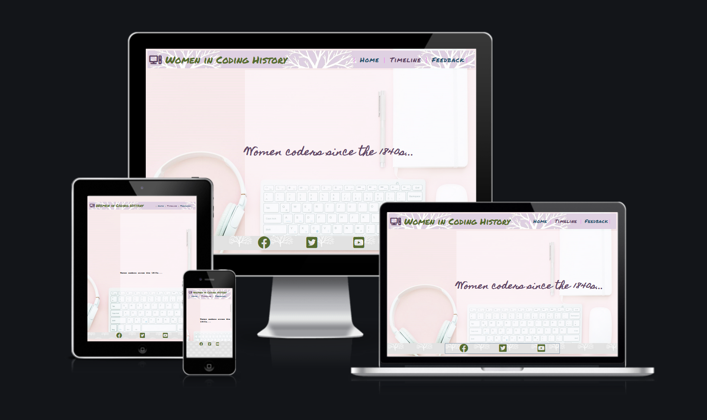

# **Women in Coding History (WICH)**

Did you know that women have been writing machine-readable code since the 1840s? And that coding used to be considered "women's work"? Yet according to a Statista poll taken in 2021, only 5% of software developers worldwide are female.

This site is both a general interest and educational resource that shows how women have in fact shaped the world of coding since its inception, from before the first computing device was even invented. The website includes an illustrated timeline. This will eventually include current and future projects being headed by female coders, not just historical figures. I also hope to add a page with links to resources for women and girls who want to learn more about coding and the tech industry. 

The project is a work in progress, with more figures who need including on the timeline. It is aimed at both school children and adults who do not necessarily know much about programming, tech, or the history behind its development. Any technical terms used are therefore explained in simple and accessible language. 

The objective is to educate and engage women and girls who would not "normally" be interested in this subject or who are new to it. The colour palette and imagery is therefore gentle, non-glaring, friendly, and "soft". The site is meant to be inviting to those who might otherwise feel intimidated by tech talk. 

The greater aim is to contribute towards gender equality in the field of software engineering and to raise awareness of the great accomplishments already been achieved by female coders. The knowledge of positive role models, past and present, will hopefully inspire women and girls to feel "I could do this, too!"

## **User Experience**

Accessibility is an important part of this project, not only it is central to how this particular work is being assessed but because, as mentioned above, this is a site aimed at a non-specialist audience aged 13 years and up. Young readers need content that is easier to understand and navigate, as do those who may not describe themselves as “tech-savvy”.
Simple language is used throughout the site for this reason, and the inclusion of images and media links keeps the content varied, engaging and educational for those who want to explore more about the female coders introduced on the timeline.
A timeline format was used as this lay-out is simple to follow, carrying the reader from the 1840s to the current day. Entries that describe female coders through history are short and concise, aimed at the concentration levels of a young audience or an adult scrolling through the internet in their coffee break. 

The homepage and feedback form are therefore minimalist, with little content, and get straight to the point. The focus is clear – the timeline. But the landing page is also attractive in a “soft” way that is pleasing to the eye, and as discussed in the introduction, uses a gentle palette of colours that puts the audience at ease. The imagery of nature and trees is used subtly throughout for the headings and footers, as nature generally helps people to relax. The imagery of trees also feeds into the idea of growth – personal growth through learning and evolution through time. Family trees are used to illustrate the growth of a family through many years, and the idea of using tree-imagery on a history site came from this usage.

The site is not aimed at very young primary school aged children, where the use of bright colours and busy content would have been more appropriate. However, I used to be a Montessori teacher, and the site would be suitable for some elementary school aged children in such an educational setting (where over-busy decoration is discouraged, and natural colours are used more often).
The colour palette of lilacs, blues, greens and soft brown is meant to reflect nature through use of the colours of flowers, grass, sky and trees. The surface level of the website is therefore entirely designed to put the eye, and the audience, at ease and to let the reader feel gently invited to the content.

Simplicity is at the heart of the basic navigation structure: a homepage that introduces the subject area and content of the site in one line, and just two other navigation options… The timeline and a feedback page. Consistency of design is used throughout the site, in terms of the headers and footers and the location of these features. The site is easy and simple to follow. This was a priority right from the onset of designing the site, when I hand-drew a wireframe...

 

